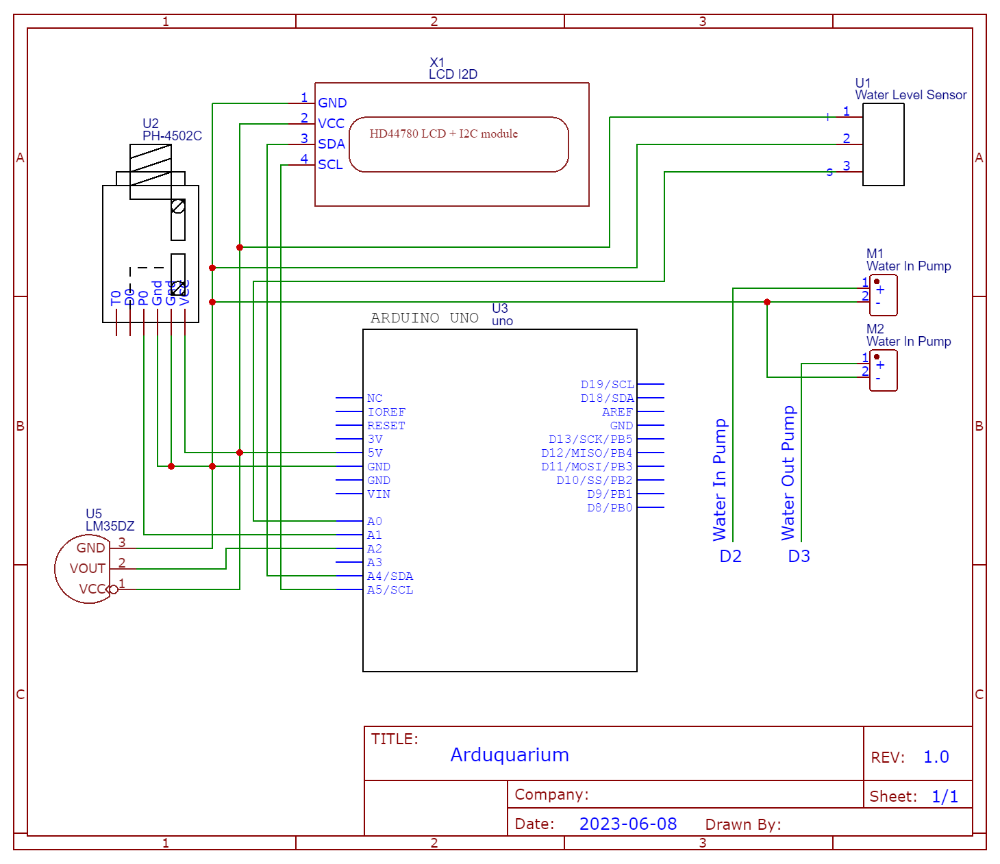

# Arduquarium: Automated Aquarium Water Cycler

The Arduquarium is an automated aquarium water cycler project built using an Arduino UNO board that provides an automated solution for maintaining optimal water conditions in your aquarium while promoting sustainable water usage. By monitoring the pH level and water level in the aquarium, the system takes actions to ensure a healthy environment for your aquatic pets and simultaneously recycles water for plant nourishment.

## Features

- **pH Level Monitoring**: The system incorporates a pH sensor that continuously measures the pH level of the aquarium water. If the pH level falls below 6.5 or rises above 7.5, the system takes corrective action.

- **Water Pump and Drainage System**: When an imbalance in pH is detected, the system activates a water pump, efficiently draining water from the aquarium. The water is then directed to a container placed above the aquarium.

- **Plant Nourishment**: The container above the aquarium is designed to hold plants, which benefit from the nutrients present in the aquarium water. As the drained water fills the container, the plants are nourished, providing a natural filtration process and promoting sustainable water usage.

- **Automated Refill**: The system includes a water level sensor that constantly monitors the water level in the aquarium. When the water level falls below a predetermined minimum, the system triggers the refill process.

- **Efficient Water Management**: The filtered water from the plant container, enriched with nutrients and filtered through the plant's root systems, is redirected back into the aquarium, replenishing the water level. This ensures efficient water usage and minimizes waste.

## Getting Started

To set up the Automated Aquarium Water Cycler, follow these steps:

1. Clone the repository to your local machine.
2. Connect the Arduino UNO board to your computer.
3. Install the [PlatformIO Extension](https://platformio.org) to your Visual Studio Code.
4. Open the `src` from the cloned folder from Git using the PlatformIO installed to your VS Code.
5. Upload the code to your Arduino UNO.

## Schematic Diagram

The schematic diagram below illustrates the connections and components used in the Automated Aquarium Water Cycler system. The following components are included:

* **Arduino UNO**: The main control unit responsible for running the system.
* **PH-4502C**: The high-precision pH sensor for monitoring the pH level of the aquarium water.
* **LM35DZ**: A temperature sensor used to gather temperature data in the aquarium.
* **LCD I2C**: A liquid crystal display module for displaying real-time information about the system.
* **Two 5V Water Pump DC Motors**: These motors are used for pumping water in and/or out of the aquarium and refilling it.
* **Water Level Sensor**: The sensor that detects the water level in the aquarium.

Please refer to the schematic diagram and the accompanying pinout information for the correct connections between the components and the Arduino UNO.

## Dependencies

The project relies on the following libraries:

1. **[LiquidCrystal_I2C](https://github.com/johnrickman/LiquidCrystal_I2C)**: LiquidCrystal Arduino library for I2C LCD displays

## Contributions

Contributions to this project are highly appreciated! If you encounter any issues or have ideas for improvements, please open an issue or submit a pull request. Your contributions will help enhance the functionality and usability of this project.

## License

This project is licensed under the MIT License. Feel free to use, modify, and distribute this code for personal and educational purposes.

Copyright 2023 - Nathanne Isip

Permission is hereby granted, free of charge, to any person obtaining a copy of this software and associated documentation files (the “Software”), to deal in the Software without restriction, including without limitation the rights to use, copy, modify, merge, publish, distribute, sublicense, and/or sell copies of the Software, and to permit persons to whom the Software is furnished to do so, subject to the following conditions:

The above copyright notice and this permission notice shall be included in all copies or substantial portions of the Software.

THE SOFTWARE IS PROVIDED “AS IS”, WITHOUT WARRANTY OF ANY KIND, EXPRESS OR IMPLIED, INCLUDING BUT NOT LIMITED TO THE WARRANTIES OF MERCHANTABILITY, FITNESS FOR A PARTICULAR PURPOSE AND NONINFRINGEMENT. IN NO EVENT SHALL THE AUTHORS OR COPYRIGHT HOLDERS BE LIABLE FOR ANY CLAIM, DAMAGES OR OTHER LIABILITY, WHETHER IN AN ACTION OF CONTRACT, TORT OR OTHERWISE, ARISING FROM, OUT OF OR IN CONNECTION WITH THE SOFTWARE OR THE USE OR OTHER DEALINGS IN THE SOFTWARE.